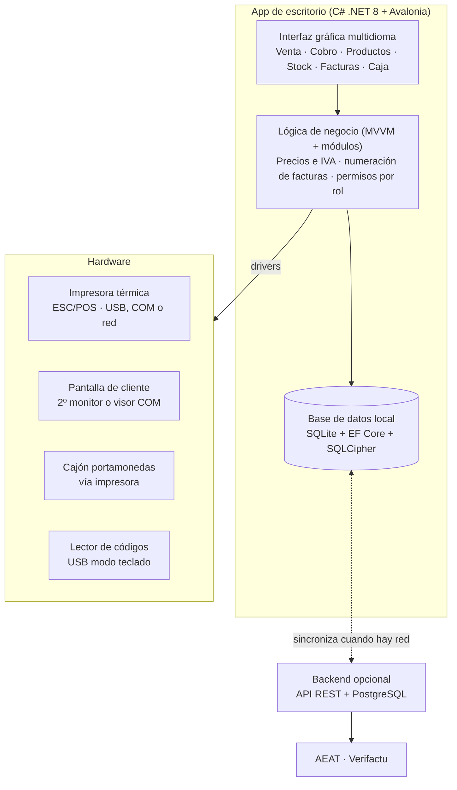

# ProyPOS — TPV de escritorio multidioma

TPV (punto de venta) de escritorio para PC, pensado para negocios pequeños de hostelería o comercio. Gestiona **ventas, cobro, inventario, tickets, facturas y caja**, funciona **sin conexión** y sincroniza con un backend opcional cuando hay red.

> **Estado:** fase de especificación. Todavía no hay código; este repositorio parte de la especificación funcional (41 user stories en 9 módulos). Ver [docs/user-stories.md](docs/user-stories.md).

---

## Índice

1. [Alcance del MVP](#alcance-del-mvp)
2. [Roles](#roles)
3. [Módulos](#módulos)
4. [Arquitectura](#arquitectura)
5. [Stack tecnológico](#stack-tecnológico)
6. [Estructura del proyecto](#estructura-del-proyecto)
7. [Primeros pasos](#primeros-pasos)
8. [Idiomas](#idiomas)
9. [Requisitos no funcionales](#requisitos-no-funcionales)
10. [Roadmap](#roadmap)
11. [Decisiones abiertas](#decisiones-abiertas)
12. [Contribuir](#contribuir)

---

## Alcance del MVP

**Dentro:** vender, cobrar, controlar stock y cerrar caja desde el PC del mostrador, en el idioma de cada usuario. La arquitectura por módulos permite añadir funciones sin rehacer la app.

**Fuera del MVP:** tienda online, fidelización avanzada y multi-local.

El MVP son las **21 historias con prioridad M**, repartidas en 4 sprints de 2 semanas.

## Roles

| Rol | Qué hace | Permisos clave |
|---|---|---|
| **Administrador** | Configura negocio, productos, precios, stock, impresora y pantalla; ve reportes | Todo: usuarios, precios, impuestos, devoluciones, ajustes de stock, facturas rectificativas |
| **Cajero** | Vende, cobra, imprime tickets y emite facturas | Vender, cobrar, imprimir, consultar stock. **No** cambia precios ni anula ventas cerradas |

Cuando un cajero intenta una acción de administrador, la app pide el PIN de un administrador (USR-02).

## Módulos

| # | Módulo | Prefijo | Historias | MVP (M) |
|---|---|---|---|---|
| 1 | Ventas y cobro | `VEN` | 6 | VEN-01 … VEN-04 |
| 2 | Productos y precios | `PRE` | 4 | PRE-01, PRE-02 |
| 3 | Inventario | `INV` | 6 | INV-01 … INV-03 |
| 4 | Impresión de tickets | `IMP` | 4 | IMP-01 … IMP-03 |
| 5 | Facturación | `FAC` | 5 | FAC-01, FAC-02 |
| 6 | Caja | `CAJ` | 3 | CAJ-01, CAJ-02 |
| 7 | Hardware | `HW` | 4 | HW-01 |
| 8 | Usuarios y seguridad | `USR` | 3 | USR-01, USR-02 |
| 9 | Idiomas y extensibilidad | `CFG` | 6 | CFG-01, CFG-04 |
| | **Total** | | **41** | **21** |

Prioridades: **M** = imprescindible para el MVP · **S** = segunda versión · **C** = deseable.

Detalle completo con criterios de aceptación: [docs/user-stories.md](docs/user-stories.md).

## Arquitectura

La app funciona sola en el PC; la nube es opcional. **La base de datos local es la fuente de verdad** en el dispositivo; el backend solo replica y envía los registros de facturación a la AEAT.



Tres capas (UI → lógica → datos) y cuatro periféricos.

## Stack tecnológico

| Pieza | Tecnología |
|---|---|
| Lenguaje y UI | C# + .NET 8, [Avalonia UI](https://avaloniaui.net/), patrón MVVM |
| Idiomas | Ficheros de recursos JSON (o `.resx`) por idioma, cargados en tiempo de ejecución |
| Módulos | Un proyecto por área con interfaces comunes; inyección de dependencias |
| Base de datos | SQLite + Entity Framework Core con migraciones; cifrado con SQLCipher |
| Impresora | Librería ESC/POS para .NET (USB, serie COM o red) |
| Pantalla de cliente | Segunda ventana en monitor secundario, o visor por COM |
| Códigos de barras | Lector USB en modo teclado |
| Backend (opcional) | ASP.NET Core o Node.js + PostgreSQL |
| Entrega | Instalador MSI para Windows con actualización automática |

**Alternativa web:** Tauri (Rust) + React con i18next. Más ligera, pero con más trabajo para acceder a puertos serie e impresoras.

## Estructura del proyecto

Estructura propuesta (aún no creada):

```text
ProyPOS/
├── src/
│   ├── Pos.App/                 # Shell Avalonia: ventanas, navegación, DI, temas
│   ├── Pos.Core/                # Dominio, interfaces comunes (IModule, IPrinter…), reglas de IVA
│   ├── Pos.Data/                # EF Core, DbContext, migraciones, SQLCipher
│   ├── Pos.Localization/        # Carga de traducciones y formatos regionales
│   └── Modules/
│       ├── Pos.Modules.Sales/       # VEN
│       ├── Pos.Modules.Products/    # PRE
│       ├── Pos.Modules.Inventory/   # INV
│       ├── Pos.Modules.Printing/    # IMP
│       ├── Pos.Modules.Invoicing/   # FAC
│       ├── Pos.Modules.CashRegister/# CAJ
│       ├── Pos.Modules.Hardware/    # HW
│       └── Pos.Modules.Users/       # USR
├── locales/                     # es.json, ca.json, en.json, zh.json, de.json, fr.json…
├── tests/
│   ├── Pos.Core.Tests/
│   └── Pos.Modules.*.Tests/
├── docs/
│   └── user-stories.md
└── README.md
```

Regla de dependencias: los módulos dependen de `Pos.Core`, nunca entre sí ni de `Pos.App`. Así se añaden módulos nuevos sin tocar el núcleo.

## Primeros pasos

### Requisitos

- Windows 10/11 de 64 bits (preparado para Linux y macOS)
- [.NET 8 SDK](https://dotnet.microsoft.com/download/dotnet/8.0)
- Pantalla de al menos 1366×768, táctil o ratón y teclado
- Opcional: impresora térmica ESC/POS (58 u 80 mm), lector de códigos USB

### Compilar y ejecutar

> Estos comandos funcionarán cuando exista la solución (Sprint 1).

```bash
git clone <url-del-repo> ProyPOS
cd ProyPOS
dotnet restore
dotnet build
dotnet run --project src/Pos.App
```

### Tests

```bash
dotnet test
```

### Base de datos

```bash
# Crear una migración nueva
dotnet ef migrations add <Nombre> --project src/Pos.Data --startup-project src/Pos.App

# La app aplica las migraciones pendientes al arrancar
```

## Idiomas

- Todos los textos de la interfaz viven en `locales/<código>.json`, **nunca en el código**.
- Añadir un idioma = añadir un fichero; **no hace falta recompilar** (CFG-05).
- El cambio de idioma se aplica **sin reiniciar** (CFG-01).
- Codificación UTF-8 obligatoria (alfabetos como el chino).
- Moneda, fecha y separadores decimales según la región; euro por defecto (CFG-04).
- Los datos fiscales del ticket **no se traducen** (CFG-03).

Idiomas previstos: español, catalán, inglés, chino, alemán y francés.

## Requisitos no funcionales

| Área | Requisito |
|---|---|
| Interfaz | Pantalla completa, botones grandes para uso táctil, tema claro/oscuro, atajos F1–F12 |
| Rendimiento | Añadir producto < 200 ms · cobro + impresión < 3 s · 5.000 productos sin lentitud |
| Offline | Ventas, cobro, impresión y facturas funcionan sin red; sincroniza al reconectar |
| Seguridad | PIN con hash · BD local cifrada · los datos de facturación no se pueden borrar |
| Cumplimiento | Factura simplificada y completa según el reglamento español; preparada para Verifactu |
| Fiabilidad | Copia de seguridad diaria automática · ninguna venta se pierde si el PC se apaga a mitad |
| Extensibilidad | Módulos con interfaces internas · migraciones versionadas · módulos nuevos sin tocar el núcleo |

## Roadmap

| Fase | Contenido | Historias |
|---|---|---|
| **Sprint 1 — Base** | Login, roles, catálogo, apertura de caja, sistema de idiomas | USR-01, USR-02, PRE-01, PRE-02, CAJ-01, CFG-01, CFG-04 |
| **Sprint 2 — Vender y cobrar** | Ticket, cobro efectivo/tarjeta/mixto, descuento de stock | VEN-01 … VEN-04, INV-01, INV-02 |
| **Sprint 3 — Imprimir y facturar** | Impresora térmica, tickets y facturas | HW-01, IMP-01 … IMP-03, FAC-01, FAC-02 |
| **Sprint 4 — Cierre y stock** | Entradas de mercancía, cierre Z, pruebas, instalador Windows | INV-03, CAJ-02 |
| **Versión 2** | Pantalla de cliente, cajón, lector, descuentos, devoluciones, rectificativas, Verifactu, alertas y ajustes de stock, cambio masivo de precios, informe de ventas, exportación, auditoría, idioma por usuario, ticket en idioma del cliente, actualizaciones automáticas | Historias **S** |
| **Versión 3** | Historial de precios, recuento físico, ticket digital, módulos ampliables (reservas, fidelización, cocina) | Historias **C** |

## Decisiones abiertas

Puntos de la especificación que conviene cerrar antes de empezar:

- **Bluetooth (HW-01):** la historia pide impresora por Bluetooth, USB o red, pero el stack solo cubre USB, serie COM y red. En Windows, muchas impresoras Bluetooth se exponen como puerto COM virtual; hay que confirmarlo con el modelo real.
- **Código de barras en el MVP:** VEN-01 (M) incluye añadir por código de barras, mientras que el lector (HW-04) es de V2. Como el lector USB funciona en modo teclado, basta con un campo de búsqueda que acepte el código; el aviso de código desconocido y el escaneo por cámara quedan para V2.
- **Backend:** ASP.NET Core o Node.js. ASP.NET Core permite compartir modelos con la app en C#.
- **Formato de traducciones:** JSON o `.resx`. JSON encaja mejor con "añadir idioma sin recompilar".

## Contribuir

- Una rama por historia: `feature/VEN-01-anadir-productos`.
- Mensajes de commit que referencien el ID: `VEN-01: búsqueda por nombre en el ticket`.
- Cada historia se da por terminada cuando cumple **todos** sus criterios de aceptación y tiene tests.
- Ningún texto visible en el código: siempre clave de traducción.

---

Especificación original: *App POS — Especificación funcional y User Stories*, 1 oct 2026, @Jiahao.
