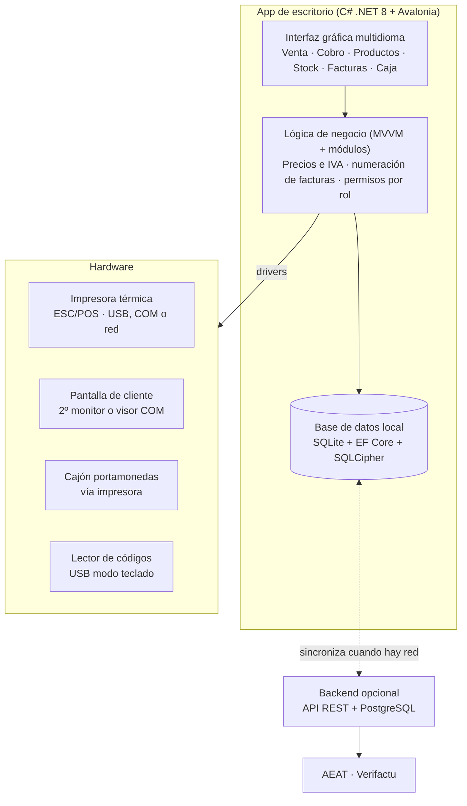

# StarSeaPOS — TPV de escritorio para bazar

TPV (punto de venta) de escritorio para PC, pensado para una **tienda de bazar**. Gestiona **ventas, cobro, inventario, tickets, facturas, caja y Verifactu**. Es multidioma y modular, funciona **sin conexión** y sincroniza con un backend opcional cuando hay red.

> **Estado:** **Secciones 1 y 2 terminadas** (Sprints 1 y 2): login con PIN, roles, catálogo, caja, idiomas y formatos regionales; venta con escáner, ticket, cobro en efectivo, tarjeta o mixto, descuento de stock, artículo genérico y alta rápida. 144 tests. Siguiente: sección 3 (imprimir y facturar). Especificación completa en [docs/user-stories.md](docs/user-stories.md).

---

## Índice

1. [Alcance del MVP](#alcance-del-mvp)
2. [Roles](#roles)
3. [Módulos](#módulos)
4. [Arquitectura](#arquitectura)
5. [Stack tecnológico](#stack-tecnológico)
6. [Estructura del proyecto](#estructura-del-proyecto)
7. [Primeros pasos](#primeros-pasos)
8. [Idiomas](#idiomas)
9. [Verifactu](#verifactu)
10. [Requisitos no funcionales](#requisitos-no-funcionales)
11. [Roadmap](#roadmap)
12. [Decisiones abiertas](#decisiones-abiertas)
13. [Contribuir](#contribuir)

---

## Alcance del MVP

**Dentro:** vender, cobrar, controlar stock y cerrar caja desde el PC del mostrador, en el idioma de cada usuario. Incluye las funciones propias de un bazar (escáner, artículo genérico, alta rápida, compra por cajas, etiquetas) y el envío de facturas a la AEAT con Verifactu.

**Fuera del MVP:** tienda online, fidelización avanzada y multi-local.

El MVP son las **34 historias con prioridad M**, repartidas en **5 sprints de 2 semanas**.

## Roles

| Rol | Qué hace | Permisos clave |
|---|---|---|
| **Administrador** | Configura negocio, productos, precios, stock, impresora y pantalla; ve reportes | Todo: usuarios, precios, impuestos, devoluciones, ajustes de stock, facturas rectificativas |
| **Cajero** | Vende, cobra, imprime tickets y emite facturas | Vender, cobrar, imprimir, consultar stock. **No** cambia precios ni anula ventas cerradas |

Cuando un cajero intenta una acción de administrador, la app pide el PIN de un administrador (USR-02).

## Módulos

| # | Módulo | Prefijo | Historias | MVP (M) |
|---|---|---|---|---|
| 1 | Ventas y cobro | `VEN` | 6 | VEN-01 … VEN-04 |
| 2 | Productos y precios | `PRE` | 4 | PRE-01, PRE-02 |
| 3 | Inventario | `INV` | 6 | INV-01 … INV-03 |
| 4 | Impresión de tickets | `IMP` | 4 | IMP-01 … IMP-03 |
| 5 | Facturación | `FAC` | 6 | FAC-01, FAC-02, FAC-04, FAC-06 |
| 6 | Caja | `CAJ` | 3 | CAJ-01, CAJ-02 |
| 7 | Hardware | `HW` | 4 | HW-01, HW-04 |
| 8 | Usuarios y seguridad | `USR` | 3 | USR-01, USR-02 |
| 9 | Idiomas y extensibilidad | `CFG` | 6 | CFG-01, CFG-04 |
| 10 | Conexión con Verifactu | `VFA` | 6 | VFA-01, VFA-02, VFA-03, VFA-06 |
| 11 | Importar y exportar datos | `DAT` | 5 | DAT-01, DAT-03 |
| 12 | Funciones de bazar | `BAZ` | 7 | BAZ-01 … BAZ-04 |
| | **Total** | | **60** | **34** |

Prioridades: **M** = imprescindible para el MVP · **S** = segunda versión · **C** = deseable.

Detalle completo con criterios de aceptación: [docs/user-stories.md](docs/user-stories.md).

## Arquitectura

La app funciona sola en el PC; la nube es opcional. **La base de datos local es la fuente de verdad** en el dispositivo; el backend solo replica y envía los registros de facturación a la AEAT.



Tres capas (UI → lógica → datos) y cuatro periféricos.

## Stack tecnológico

| Pieza | Tecnología |
|---|---|
| Lenguaje y UI | C# + .NET 8, [Avalonia UI](https://avaloniaui.net/), patrón MVVM |
| Idiomas | Ficheros JSON por idioma, cargados en tiempo de ejecución |
| Módulos | Un proyecto por área con interfaces comunes; inyección de dependencias |
| Base de datos | SQLite + Entity Framework Core con migraciones; cifrado con SQLCipher |
| Verifactu | Cliente del servicio web SOAP de la AEAT con certificado X.509; huella SHA-256 encadenada; QR de cotejo; cola de envíos en la BD |
| Importar / exportar | CSV y Excel (ClosedXML o similar); copia de seguridad = archivo SQLite cifrado y comprimido |
| Impresora | Librería ESC/POS para .NET (USB, serie COM o red) |
| Pantalla de cliente | Segunda ventana en monitor secundario, o visor por COM |
| Códigos de barras | Lector USB en modo teclado |
| Backend (opcional) | ASP.NET Core o Node.js + PostgreSQL |
| Entrega | Instalador MSI para Windows con actualización automática |

**Alternativa web:** Tauri (Rust) + React con i18next. Más ligera, pero con más trabajo para acceder a puertos serie e impresoras.

## Estructura del proyecto

```text
StarSeaPOS/
├── StarSeaPOS.sln
├── Directory.Build.props        # net8.0, nullable, usings implícitos para todos los proyectos
├── Directory.Packages.props     # Versiones de NuGet centralizadas
├── global.json                  # Fija el SDK .NET 8
├── src/
│   ├── Pos.App/                 # Shell Avalonia: ventanas, MVVM, DI (Composition.cs), temas
│   ├── Pos.Core/                # Dominio, IModule, ILocalizer, PinHasher, cálculo de IVA
│   ├── Pos.Data/                # EF Core, PosDbContext, migraciones, SQLCipher
│   ├── Pos.Localization/        # JsonLocalizer: carga locales/*.json en tiempo de ejecución (CFG)
│   └── Modules/
│       ├── Pos.Modules.Sales/        # VEN
│       ├── Pos.Modules.Products/     # PRE
│       ├── Pos.Modules.Inventory/    # INV
│       ├── Pos.Modules.Printing/     # IMP
│       ├── Pos.Modules.Invoicing/    # FAC
│       ├── Pos.Modules.CashRegister/ # CAJ
│       ├── Pos.Modules.Hardware/     # HW
│       ├── Pos.Modules.Users/        # USR
│       ├── Pos.Modules.Verifactu/    # VFA
│       ├── Pos.Modules.DataTransfer/ # DAT
│       └── Pos.Modules.Bazaar/       # BAZ
├── locales/                     # es.json, ca.json, en.json, zh.json, de.json, fr.json
├── tests/
│   ├── Pos.Core.Tests/          # PIN, IVA, traducciones completas (incluidas las claves usadas en el código)
│   ├── Pos.Modules.Tests/       # Servicios de negocio sobre SQLite real (en memoria y cifrada en disco)
│   └── Pos.App.Tests/           # Recorridos de interfaz headless (Avalonia) y capturas de pantalla
├── docs/
│   └── user-stories.md
└── README.md
```

Regla de dependencias: los módulos dependen de `Pos.Core` y `Pos.Data`, nunca entre sí ni de `Pos.App`. Cada módulo registra sus servicios en `ConfigureServices`; las vistas y ViewModels viven en `Pos.App`. CFG no es un módulo aparte: vive en `Pos.Localization` y en la página de Ajustes.

### Cómo está hecha la sección 1

| Historia | Dónde | Notas |
|---|---|---|
| USR-01 PIN de 4 dígitos | `UserService.SignIn`, `LoginView`, `PinPadView` | Tocar el nombre y teclear el PIN (táctil o teclado). Tras 5 fallos, bloqueo de 5 minutos; un admin puede desbloquear antes. Cierre de sesión por inactividad configurable (5 min por defecto) |
| USR-02 Roles | `WorkspaceViewModel.Navigate`, `AdminPinPromptView` | Productos, Categorías, Usuarios y Ajustes son de admin: a un cajero se le pide el PIN de un admin para esa visita. No se puede quitar el último admin |
| PRE-01 Productos | `CatalogService`, `ProductsPageView` | Nombre, precio con IVA incluido, IVA (21/10/4/0 %), código único, categoría, foto, unidades por caja. Los productos no se borran: se desactivan |
| PRE-02 Categorías | `CatalogService`, `CategoriesPageView`, `SalePageView` | Botones de color en la venta. Una categoría puede marcarse como sección de artículo genérico (BAZ-02) |
| CAJ-01 Abrir caja | `CashRegisterService`, `SalePageView` | Con la caja cerrada, la pantalla de venta solo deja abrirla |
| CFG-01 Idioma | `JsonLocalizer`, `SettingsPageView` | Cambia todos los textos sin reiniciar. Un test falla si el código usa una clave que no existe |
| CFG-04 Región | `RegionFormatter` | Euro por defecto; separadores según el idioma; formato de fecha elegible. `12.50` y `12,50` se leen igual al teclear importes |

Primer arranque: con la BD vacía, la app pide crear el administrador.

### Cómo está hecha la sección 2

| Historia | Dónde | Notas |
|---|---|---|
| VEN-01 Añadir productos | `SalePageView`, `CatalogService.Search` | Por categoría (botones), búsqueda por nombre o código de barras. `3*código` añade 3 unidades |
| VEN-02 Cantidades y líneas | `Ticket` (módulo Sales) | El ticket vive en memoria hasta cobrar: quitar una línea no deja rastro. Botones −, + y ✕ |
| VEN-03 Efectivo | `PaymentView`, `SalesService.Checkout` | Muestra el cambio al teclear; botones de importe justo y billetes; vacío = importe justo. No deja cobrar menos del total |
| VEN-04 Tarjeta y mixto | `PaymentRequest` | Se guarda el importe de cada método; la suma es siempre el total |
| INV-01 Descuento de stock | `StockLedger` | Cada venta resta stock y deja un movimiento, en la misma transacción que la venta. El stock puede quedar en negativo |
| INV-02 Consulta de stock | Botones de producto, página Productos | Visible para el cajero; no hay ningún sitio donde editarlo (eso es INV-03/05) |
| HW-04 Escáner | `SalePageView.axaml.cs` | Lector USB en modo teclado: todo lo tecleado fuera de un cuadro de texto va al buscador, así no se pierde ningún escaneo. Código desconocido = aviso + alta rápida |
| BAZ-02 Artículo genérico | Botones de sección | Categorías marcadas como sección: importe libre, IVA general (21 %), cuenta en las ventas por sección |
| BAZ-03 Alta rápida | `QuickCreateView`, `CatalogService.QuickCreate` | Nombre, precio y sección con el código ya relleno. Si lo crea un cajero queda pendiente de revisión (filtro en Productos) |

Atajos: **F12** cobrar · **Esc** cerrar la ventana de cobro / alta rápida · **Enter** confirmar.

**Seguridad de los datos de venta:**
- Venta, líneas, pagos y stock se guardan en **una sola transacción**: o se guarda todo o nada.
- SQLite con `synchronous = FULL`: cuando la app dice "cobrada", la venta ya está en disco aunque se vaya la luz.
- Triggers en la BD impiden **modificar o borrar** ventas, líneas y pagos (datos de facturación).
- La línea guarda nombre, precio e IVA del momento: cambiar el producto después no altera ventas pasadas.

## Primeros pasos

Guía completa para preparar el PC (herramientas, IDE, base de datos, hardware, problemas frecuentes): [entornoDeConfiguracion.md](entornoDeConfiguracion.md).

### Requisitos

- **Windows 11 de 64 bits** (único sistema soportado)
- [.NET 8 SDK](https://dotnet.microsoft.com/download/dotnet/8.0)
- Pantalla de al menos 1366×768, táctil o ratón y teclado
- Opcional: impresora térmica ESC/POS (58 u 80 mm), impresora de etiquetas, lector de códigos USB
- Para Verifactu: certificado digital del negocio (.pfx)

### Compilar y ejecutar

```powershell
git clone <url-del-repo> StarSeaPOS
cd StarSeaPOS
dotnet tool restore          # dotnet-ef, versión fijada en .config/dotnet-tools.json
dotnet build
dotnet run --project src/Pos.App -- --windowed
```

- `--windowed`: ventana maximizada en lugar de pantalla completa (cómodo para desarrollar).
- `$env:STARSEAPOS_DATA_DIR = "<carpeta>"`: usa otra carpeta de datos en vez de `%LOCALAPPDATA%\StarSeaPOS` (útil para empezar con una BD vacía).

### Tests

```powershell
dotnet test

# Además, capturas PNG de las pantallas para revisarlas a ojo:
$env:STARSEAPOS_SCREENSHOTS = "<carpeta>"; dotnet test tests/Pos.App.Tests --filter ScreenshotTests
```

### Base de datos

- Fichero: `%LOCALAPPDATA%\StarSeaPOS\pos.db`, cifrado con SQLCipher.
- Clave: aleatoria, guardada en `pos.key` junto a la BD y protegida con DPAPI (solo esa cuenta de Windows en ese PC puede usarla). Copiar `pos.db` a otro PC no sirve sin la clave: las copias de seguridad (DAT-03) tendrán su propia contraseña.
- Las migraciones se aplican solas al arrancar.

```powershell
# Crear una migración nueva (usa DesignTimeDbContextFactory, no necesita la clave real)
dotnet ef migrations add <Nombre> --project src/Pos.Data
```

## Idiomas

- Todos los textos de la interfaz viven en `locales/<código>.json`, **nunca en el código**. En XAML: `{Binding L[Clave]}`.
- Cada fichero lleva la clave `LanguageName` con el nombre del idioma en su propia lengua (sale en el selector).
- Un test comprueba que todos los idiomas tienen exactamente las mismas claves que `es.json`.
- Añadir un idioma = añadir un fichero; **no hace falta recompilar** (CFG-05).
- El cambio de idioma se aplica **sin reiniciar** (CFG-01).
- Codificación UTF-8 obligatoria (alfabetos como el chino).
- Moneda, fecha y separadores decimales según la región; euro por defecto (CFG-04).
- Los datos fiscales del ticket **no se traducen** (CFG-03).

Idiomas previstos: español, catalán, inglés, chino, alemán y francés.

## Verifactu

Obligatorio desde el **1 de enero de 2027** para sociedades y el **1 de julio de 2027** para autónomos (RDL 15/2025).

- Cada factura lleva **huella SHA-256 encadenada** con la anterior y **QR de cotejo** (FAC-04).
- Los registros de alta y anulación se envían al servicio web SOAP de la AEAT con el certificado del negocio (VFA-01, VFA-02).
- Sin internet, los envíos van a una **cola persistente** en la BD y se reintentan respetando el tiempo de espera que indica la AEAT (VFA-03). **Nunca se deja de vender.**
- La declaración responsable del software se ve en "Acerca de" (VFA-06).
- El MVP solo implementa la modalidad VERI\*FACTU; la modalidad no VERI\*FACTU (VFA-04) es de la versión 2.

## Requisitos no funcionales

| Área | Requisito |
|---|---|
| Plataforma | **Solo Windows 11 de 64 bits.** La especificación pedía dejarla preparada para Linux y macOS; se descartó el 1 oct 2026 |
| Interfaz | Pantalla completa, botones grandes para uso táctil, tema claro/oscuro, atajos F1–F12 para cobrar e imprimir |
| Rendimiento | Añadir producto < 200 ms · cobro + impresión < 3 s · **30.000 productos con búsqueda instantánea por nombre o código** |
| Offline | Ventas, cobro, impresión y facturas funcionan sin red; sincroniza al reconectar |
| Seguridad | PIN con hash · BD local cifrada · los datos de facturación no se pueden borrar |
| Cumplimiento | Factura simplificada y completa según el reglamento español; Verifactu |
| Fiabilidad | Copia de seguridad diaria automática · ninguna venta se pierde si el PC se apaga a mitad |
| Extensibilidad | Módulos con interfaces internas · migraciones versionadas · módulos nuevos sin tocar el núcleo |

## Roadmap

| Fase | Contenido | Historias |
|---|---|---|
| **Sprint 1 — Base** | Login, roles, catálogo, apertura de caja, sistema de idiomas | USR-01, USR-02, PRE-01, PRE-02, CAJ-01, CFG-01, CFG-04 |
| **Sprint 2 — Vender y cobrar** | Venta por escáner, artículo genérico, alta rápida, cobro y descuento de stock | VEN-01 … VEN-04, INV-01, INV-02, HW-04, BAZ-02, BAZ-03 |
| **Sprint 3 — Imprimir y facturar** | Impresora térmica, tickets, facturas y facturar un ticket ya emitido | HW-01, IMP-01 … IMP-03, FAC-01, FAC-02, FAC-06 |
| **Sprint 4 — Cierre, stock y datos** | Entradas de mercancía por cajas, etiquetas de precio, cierre Z, importación de catálogo, copias de seguridad | INV-03, CAJ-02, DAT-01, DAT-03, BAZ-01, BAZ-04 |
| **Sprint 5 — Verifactu** | Huella y QR, certificado, envío a la AEAT, cola sin conexión, pruebas e instalador para Windows | FAC-04, VFA-01, VFA-02, VFA-03, VFA-06 |
| **Versión 2** | Pantalla de cliente, cajón, variantes por talla y color, verificador de precios, ticket regalo y cambios, descuentos, devoluciones, rectificativas, modalidad y panel Verifactu, alertas y ajustes de stock, cambio masivo de precios, informe de ventas, exportaciones, auditoría, idioma por usuario, tickets en el idioma del cliente, actualizaciones automáticas | Historias **S** |
| **Versión 3** | Historial de precios, recuento físico, ticket digital, migración desde otro TPV, módulos ampliables (fidelización, venta online, multi-tienda) | Historias **C** |

## Decisiones abiertas

Puntos de la especificación que conviene cerrar antes de empezar:

- **Fecha de Verifactu vs. sprint 5:** con sprints de 2 semanas, Verifactu llega en la semana 10. Si el negocio es una sociedad, la obligación empieza el 1 de enero de 2027, así que el desarrollo tendría que empezar como muy tarde a finales de octubre de 2026, sin margen para homologar con el entorno de pruebas de la AEAT. Conviene confirmar si el titular es sociedad o autónomo (1 de julio de 2027).
- **Rectificativas y Verifactu:** FAC-06 sustituye una simplificada por una completa, y VFA-02 envía registros de anulación, pero las rectificativas (FAC-03) son de la versión 2. Hay que confirmar qué tipo de registro Verifactu genera FAC-06 en el MVP.
- **Sección vs. categoría (BAZ-02, BAZ-03):** las historias de bazar hablan de "secciones" (hogar, papelería, juguetes…) y PRE-02 de "categorías". Propuesta: que sean lo mismo, con una marca para las que admiten artículo genérico.
- **Clientes (DAT-01):** se importan clientes, pero ninguna historia los gestiona. FAC-02 y FAC-06 piden datos fiscales: propuesta de guardar los clientes de esas facturas y reutilizarlos.
- **Búsqueda en 30.000 productos:** un `LIKE '%texto%'` no usa índices. Propuesta: índice FTS5 de SQLite para nombre y búsqueda exacta indexada para el código.
- **Impresora de etiquetas (BAZ-01):** las de etiquetas suelen usar ZPL o TSPL, no ESC/POS. Hay que conocer el modelo concreto.
- **Bluetooth (HW-01):** el stack solo cubre USB, serie COM y red. En Windows muchas impresoras Bluetooth se exponen como puerto COM virtual; hay que confirmarlo con el modelo real.
- **Escáner por cámara (HW-04):** implementado el lector USB en modo teclado; la lectura con cámara queda para la versión 2 (exige una librería de visión). Confirmar que basta con el lector.
- **IVA del artículo genérico y del alta rápida (BAZ-02, BAZ-03):** se usa el 21 %. Si alguna sección vende con otro tipo (por ejemplo libros al 4 %), habría que añadir un IVA por sección.
- **Stock negativo:** se permite vender aunque el stock sea 0, para no parar la venta por un recuento mal hecho; se muestra en rojo.
- **Backend:** ASP.NET Core o Node.js. ASP.NET Core permite compartir modelos con la app en C#.

## Contribuir

- Una rama por historia: `feature/VEN-01-anadir-productos`.
- Mensajes de commit que referencien el ID: `VEN-01: búsqueda por nombre en el ticket`.
- Cada historia se da por terminada cuando cumple **todos** sus criterios de aceptación y tiene tests.
- Ningún texto visible en el código: siempre clave de traducción.

---

Especificación original: [App_POS_Bazar_Especificacion_User_Stories.pdf](App_POS_Bazar_Especificacion_User_Stories.pdf), 1 oct 2026, @Jiahao.
